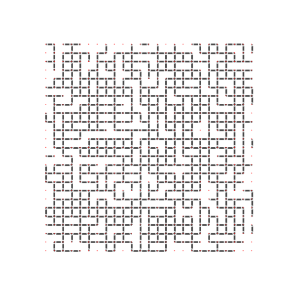

<h1>Dynamic Routing of Faulty Networks</h1>
<h2>Overview</h2>

<a href="https://igraph.org/python/api/latest/">Python i-Graph</a> is used to generate the network graphs

<a href="https://numpy.org/">Numpy</a> is used for adjacency matrix generation along with <a href="https://matplotlib.org/">Matplotlib</a> for displaying the resulting graphs

Markus Jarderot's algorithm for generating nXn grid graphs through adjacency matrix was used in this project and can be found <a href="https://stackoverflow.com/questions/16329403/how-can-you-make-an-adjacency-matrix-which-would-emulate-a-2d-grid">here</a>.

<h2>Functionality</h2>
<ol>
    <li>Generate an adjacency matrix that represents an NxN grid graph</li>
    <li>With Python iGraph, generate a new graph using the previously created adjacency matrix</li>
    <li>Using dijkstra's + the previously generated graph, find the shortest path</li>
    <li>Using the shortest path data, color this new path</li>
    <li>Delete some nodes (either on the path or using the bernoulli distribution, depending on the code that is being run) and color them red</li>
    <li>Repeat steps 3-5 until there are no paths to the target</li>
</ol>
<h2>Pretty stuff made during this project</h2>

